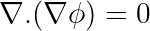
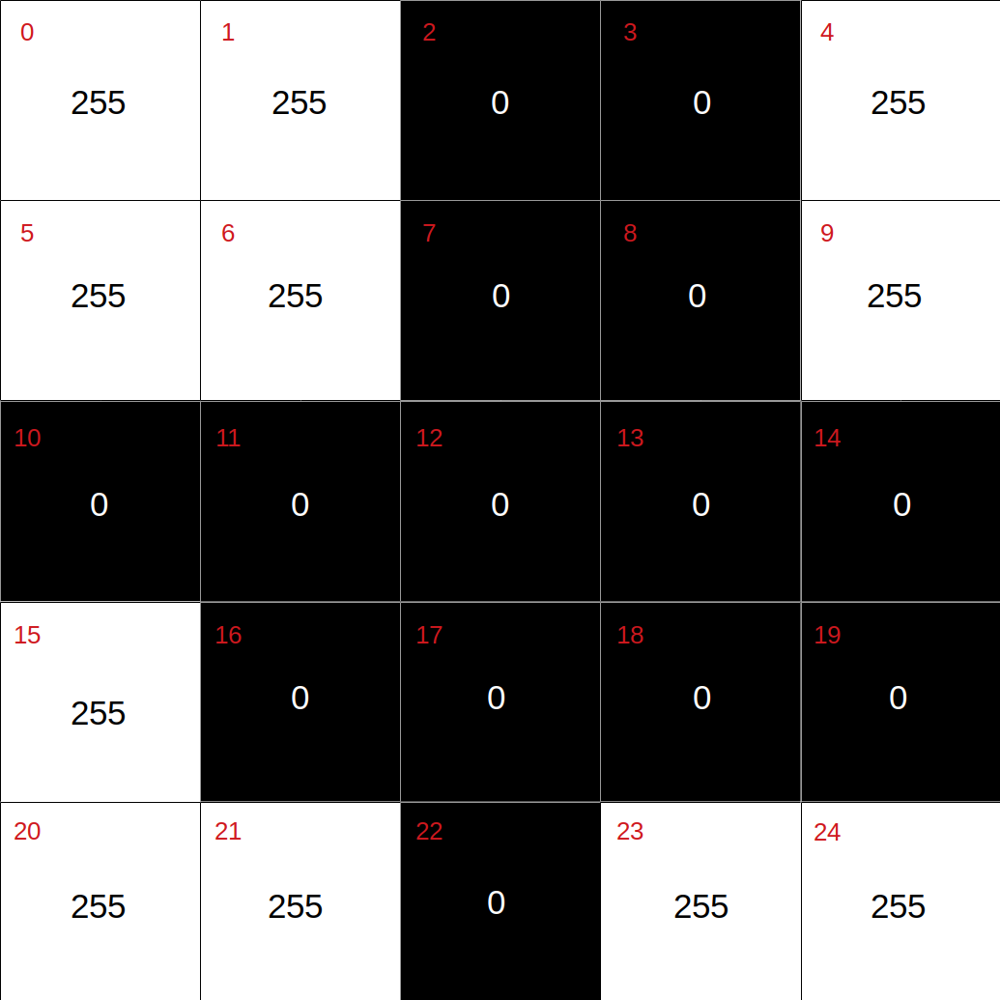
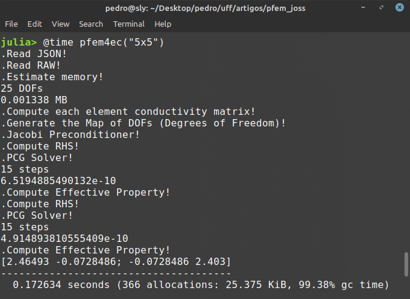

# pfem4ec

[](https://github.com/LCC-UFF/pfem4ec/blob/master/LICENSE)

## Introduction

`pfem4ec` is a fast [Julia](https://julialang.org/) in-core solver to compute effective electrical conductivity of heterogeneous materials from raw images using Pixel-Based Finite Element Method (PFEM). The software was implemented in Julia because the resulting code is as simple as it would be if it were written using a scripting language (such as Python or Matlab/Octave). On the other hand, as Julia takes advantage of a just-in-time (JIT) technology, the codes can also be as efficient as codes written using compiled programming languages (such as in C/C++ or Fortran).
 
The conventional the finite element method in the image based numerical analysis usually leads to a very large system of equations that requires an extremely large amount of memory or out-of-core methods to be solved. In that sense, `pfem4ec` is an efficient PFEM software to estimate the effective electrical conductivity of heterogeneous materials using the Element-by-Element technique in conjunction with the Preconditioned Conjugate Gradient method (PCG).


## Important notes and features

+ The code now works with Julia 1.4.1. All you need to do is to check out the master branch:
+ Direct solver using a LU factorization method from [LinearAlgebra.jl](https://github.com/JuliaLang/julia/blob/master/stdlib/LinearAlgebra/src/LinearAlgebra.jl)
+ Iterative solver using a Preconditioned Conjugate Gradient method based in [Shewchuk algorithm](https://www.cs.cmu.edu/~quake-papers/painless-conjugate-gradient.pdf)
+ Compute effective property for physical problems governed by laplace equation
+ Read binary RAW images from CT scan data
+ `pfem4ec` require a header file in JSON containing some specific parameters to guide the analysis 


## Equations
You can solve the following partial differential equation (PDE):  


<a name="laplace"><div id="laplace"></div></a>
<p align="center">
  
</p>


## Requirements

The following libraries are required, which are likely already installed on your system:
+ [JSON.jl](https://github.com/JuliaIO/JSON.jl)
+ [SparseArrays.jl](https://github.com/JuliaLang/julia/blob/master/stdlib/SparseArrays/src/SparseArrays.jl)
+ [LinearAlgebra.jl](https://github.com/JuliaLang/julia/blob/master/stdlib/LinearAlgebra/src/LinearAlgebra.jl)


## Installation

Download source code in the terminal:
```bash
git clone https://github.com/LCC-UFF/pfem4ec
```


## How to run

### Linux or Windows

Firstly, it is important to state that, even though two input files are needed, when running the code, `pfem4ec.jl` takes a single input, a string containing the name of the model (without file extensions), hence the need to give the same name to correlated RAW and JSON files.  

Users can run `pfem4ec.jl` directly from the terminal, but they need to bear in mind that Julia compiles the code prior to running, meaning that each call will take some extra time to compile (for relatively small models, this usually takes more time than the analysis itself). Certainly, if no changes are made to `pfem4ec.jl`, there’s no need to compile the same code over and over again. In light of this, the authors suggest that users run `pfem4ec.jl` from within the Julia environment, as follows.

a. Start the Julia REPL:

```bash
julia
```
P.S.: Make sure that you’re on the directory where `pfem4ec.jl` and the input files are placed.

b. Include `pfem4ec.jl`:

```julia
include(“pfem4ec.jl”)
```
P.S.: The first call will compile and run, all subsequent calls will just run, considerably 	reducing overall elapsed time to obtain results.

c. Run the `pfem4ec` function:
```julia
pfem4ec(“model_filename”)
```

d. To obtain time metrics for each time `pfem4ec` is run, simply add the Julia macro @time before the call presented above.
```julia
@time pfem4ec(“model_filename”)
```


## Input files

Two files are needed for the analysis to be run. One describes the geometry of the model (a binary RAW file), the other sets specific analysis parameters (a JSON file). **Both files must have the same name**, just different extensions. You can also have more information in our [user guide](https://github.com/JuliaIO/JSON.jl).

1. RAW file

The first input is a binary RAW file, that represents images of the microscale of a heterogeneous material with 8-bit data (integer values within the range 0 to 255). As the model is characterized as pixel-based, an image input is necessary to define the Finite Element mesh, admitting that each pixel is a quadrilateral element. The contents of the file are depicted graphically in <a href="#figure1">Figure 1</a>, where the numbers in red indicate the index of each pixel on an array that stores the 8-bit data. 

<a name="figure1"><div id="figure1"></div></a>
<p align="center">
     
</p>
<p align="center">Figure 1: Visual representation of the contents of a RAW input file for pfem4ec.jl.</p>

2. JSON header file

A second input file is necessary for `pfem4ec.jl` to be run, containing specific parameters to guide the FEM analysis. Figure 2 exposes the data that needs to be provided on a JSON file, that must have the same name as the RAW file that describes the geometry of the model.

```json
{
    "solver_tolerance": 1e-09,
    "number_of_iterations": 10000,
    "image_dimensions": [
        5,
        5,
        1
    ],
    "type_of_solver": 0,
    "type_of_rhs": 0,
    "refinement": 1,
    "number_of_materials": 2,
    "properties_of_materials": [
        [
            0,
            1.0
        ],
        [
            255,
            10.0
        ]
    ],
    "volume_fraction": [
        56.0,
        44.0
    ]
}
```

- **Solver tolerance (solver_tolerance):** The maximum accepted residual value for the Preconditioned Conjugate Gradient (PCG) Method, adopted to solve the large system of algebraic equations associated with the Finite Element Method.
- **Number of iterations (number_of_iterations):** The maximum accepted number of iterations to be run on the PCG method.
- **Image dimensions (image_dimensions):** An array of three positive integer values, associated with the dimensions of the model in pixels, on x, y, and z (left to right, up to down, and near to far), respectively. As pfem4ec.jl currently only works for 2D models, the dimension z is unused.
- **Type of solver (type_of_solver):** A flag to indicate if the system of equations must be solved with the PCG method or a direct method (matrix factorization). **0 = PCG, 1 = Direct method**. It is advised that the PCG solver is adopted, especially for large models.
- **Type of right-hand side (type_of_rhs):** A flag to switch between conditions being set on the domain or boundary of the model. **0 = Domain, 1 = Boundary**.
- **Refinement (refinement):** A positive integer value to indicate the mesh refinement from the provided image. By setting this as 1, each pixel becomes a single quadrilateral finite element. If it is set as 2, for example, each pixel will be equally subdivided into 4 quadrilateral finite elements (1x1 becomes 2x2, in this case). In an analogous fashion, if set as 3, each pixel becomes 9 equal quadrilateral finite elements, and so on.
- **Number of materials (number_of_materials):** A positive integer value to specify how many different materials are present on the heterogeneous model.
- **Properties of materials (properties_of_materials):** An array of two values for each material. The first value is an integer between 0 and 255, which correlates the materials with a grayscale color read from the RAW file. The second value is a floating-point number that provides the electrical conductivity of this specific material, assuming that it is isotropic.
- **Volume fraction (volume_fraction):** This is not an input parameter to `pfem4ec.jl`. It contains an array of percentages that indicate the proportion of occurrence of each material on the respective model. This is generated by the [pytomoviewer](https://github.com/LCC-UFF/pytomoviewer) application and is interesting for users to quickly identify any predominant materials on a determined model.


## Example usage

For now, `pfem4ec.jl` output consists on feedback of the analysis that is printed on the terminal that called the program. Users are provided with an estimation of allocated memory, convergence metrics for the PCG numerical method, a stamp for each function called by `pfem4ec` along the process and, finally, the resulting effective homogenized conductivity matrix. <a href="#figure2">Figure 2</a> shows the output for the 5x5 example model adopted in our [user guide](https://github.com/JuliaIO/JSON.jl).

<a name="figure2"><div id="figure2"></div></a>
<p align="center">
  
</p>
<p align="center">Figure 2: pfem4ec output for analysis on 5x5 model.</p>


## Acknowledgements
This research was carried out in association with the ongoing R&D project registered as ANP nº 21289-4, “Desenvolvimento de modelos matemáticos, estatísticos e computacionais para o aperfeiçoamento da caracterização petrofísica de reservatórios por Ressonância Magnética Nuclear (RMN)" (UFF/Shell Brasil/ANP), sponsored by Shell Brasil under the ANP R&D levy as “Compromisso de Investimentos com Pesquisa e Desenvolvimento”. The authors also recognize the support from CAPES, CNPq and FAPERJ.

