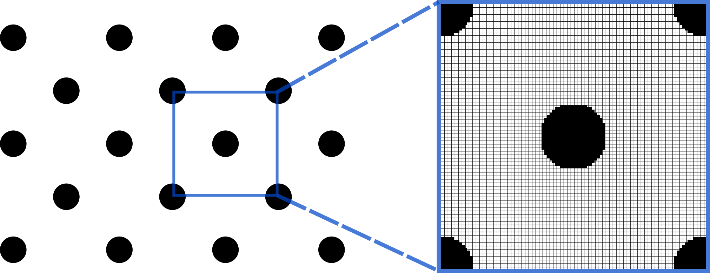

# Summary

[pfem4ec.jl](https://github.com/LCC-UFF/pfem4ec) is a Julia in-core solver to compute effective electrical conductivity of heterogeneous materials from raw images using Pixel-Based Finite Element Method (PFEM). The electric conductivity is a physical parameter that plays an important role in the chemical, electronic and petroleum industries. For composites and heterogeneous materials, it can be obtained considering the electric conduction phenomena. For the electric conduction investigation, one of the strategies that has been proven effective is the image based numerical analysis. An interesting example of image based numerical analysis is the work of @Sukiman2020 that employs the Finite Element Method (FEM) to compute effective properties from the real structure of membranes using image acquisition, where each pixel of the image is converted into a quadrilateral finite element. However, the conventional employment of the finite element method in the image based numerical analysis usually leads to a very large system of equations that requires an extremely large amount of memory or out-of-core methods to be solved. In that sense, the purpose of this work is to present an efficient PFEM software to estimate the effective electrical conductivity of heterogeneous materials using the Element-by-Element technique [@Carey1986] in conjunction with the Preconditioned Conjugate Gradient method (PCG) [@Shewchuk1994].

`pfem4ec` was implemented in Julia because the resulting code is as simple as it would be if it were written using a scripting language (such as Python or Matlab/Octave). On the other hand, as Julia takes advantage of a just-in-time (JIT) technology, the codes can also be as efficient as codes written using compiled programming languages (such as in C/C++ or Fortran) [@Perkel2019]. In the context of scientific computing, when a script-interpreted language is adopted, to avoid expensive overheads for each time that an instruction is executed, the use of implicit vectorization (SIMD extensions) naturally appears as an effective implementation strategy. However, although very powerful, there are some specific cases in which implicit vectorization is less effective than the use of the explicit loop vectorization featured in Julia. This is the case here and we employed the explicit loop vectorization strategy to develop the subroutines regarding the Element-by-Element technique in the PCG method.

# Statement of need

The prediction of effective properties is crucial to understanding the relationship between micro and macro scales of heterogeneous materials. There are several physical problems governed by the Laplace equation, e.g. electrical conductivity, which can be solved by researchers through computer simulations as an alternative to expensive laboratory experiments. The increasing necessity for fast and accurate characterization of material properties demands a new tool for efficient computation of effective properties from images of real material samples. In contrast to existing commercial software, `pfem4ec` represents a unique open-source solution that was designed to calculate effective properties efficiently, using the benefits that Julia provides while still being a friendly environment for researchers. The speed achieved by the `pfem4ec` as well as the low usage of RAM allows the analysis of very large numerical models in personal computers.

# Effective Electrical Conductivity Using Numerical Homogenization

Numerical homogenization techniques are employed to determine the effective properties of representative elementary volumes (REV) using relations between the micro and the macrostructure of the material and by considering characteristics and properties at the microscopic scale. For determining the effective electrical conductivity of a heterogeneous medium, a known potential gradient is applied to the material REV. Under this condition, a current density field will be induced in the domain. The homogenized effective property of the material $\overline{\boldsymbol{\sigma}}$ is defined as the relationship between the gradient of potential due to the conduction of electrons $\left \langle \nabla  \boldsymbol{\phi}  \right \rangle_{\Omega}$, and the average current density $\left \langle  \mathbf{i}  \right \rangle_{\Omega}$ at the macroscale, known as Ohm’s law ($\Omega$ here denotes representative volume):

\begin{equation}\label{eq:average}
\left \langle  \mathbf{i}  \right \rangle_{\Omega} = \overline{\boldsymbol{\sigma }}  \left \langle \nabla  \boldsymbol{\phi}  \right \rangle_{\Omega}
\end{equation}

in which $\left \langle  \mathbf{i}  \right \rangle_{\Omega} = \left \langle  \{ i_1,i_2 \right \}^{T}  \rangle_{\Omega}$ is the average current density vector resulted from the microscopic scale, i.e.

\begin{equation}
\left \langle  \mathbf{i}  \right \rangle_{\Omega} = \frac{1}{\Omega}\int_{\Omega }  \mathbf{i} ~d\Omega
\end{equation}

Ohm’s law, given by \autoref{eq:average}, states that the total current density is equal to the product of the medium electric conductivity (given by Siemens per meter, S/m, in the SI) and the potential gradient.

For a two-dimensional electric conduction problem, two analyses are performed by applying a unitary potential gradient in each Cartesian direction to determine its correspondent average current density vector. The average current density vector corresponds to one column of the effective electrical conductivity matrix $\overline{\boldsymbol{\sigma}}$. In the context of image based numerical analysis, both the potential field inside a (digital) representative volume and the associated average current density vector can be solved using the PFEM.

# Finite Element Method Formulation

The steady-state electric conduction equation may be written as

\begin{equation}\label{eq:electric_conduction}
{\nabla .(\sigma \nabla \phi )} = 0
\end{equation}

where $\phi$ is the electric potential in the domain $\Omega$ with the boundary $\Gamma$, and $\sigma$ is the electric conductivity of the material.

The weak form of the governing equations employing a finite element discretization can be written in the element domain as

\begin{equation}
\int_{\Omega } \mathbf{B}^{T}\boldsymbol{\sigma}\mathbf{B}~d\Omega ~\mathbf{u}= \int_{\Gamma}\mathbf{N}^{T}\mathbf{i_{n}}~d\Gamma
\end{equation}

where $\boldsymbol{\sigma}$ is the element electrical conductivity matrix, $\mathbf{u}$ is the element nodal potential due to electron conduction, $\mathbf{i_{n}}$ is the current density at the boundary, $\mathbf{N}$ is the shape function matrix of and $\mathbf{B}$ is the derivatives-of-shape-functions matrix.

Finally, using FEM to solve the partial differential \autoref{eq:electric_conduction} over the whole domain leads to the following system of linear algebraic equations

\begin{equation}
\mathbf{K}\mathbf{U}=\mathbf{q}
\end{equation}

where $\mathbf{U}$ is the global nodal potential vector, $\mathbf{K}$ is the domain conductivity matrix, and $\mathbf{q}$ is the global nodal current flow vector.

# Efficient PFEM Implementation

The most traditional FEM implementations, using direct or iteractive solvers, consist of storing in RAM the entire system of equations from the physical model. Even using techniques such as sparse matrix linear algebra to reduce the amount of used memory, this kind of approach may not be sufficient for in-core solutions of large problems. 

One of the advantages of using a Pixel-Based Method is that all elements of the model have the same geometry, resulting in a regular mesh. Hence, it can be assigned the same electrical conductivity matrix to all elements having the same physical properties. We benefit from this fact and in `pfem4ec` we store only one conductivity matrix per material, reducing tremendously both CPU and RAM usage. Nevertheless, the use of direct solvers is impracticable for large problems, because they demand the assembly of the entire equation system, which requires a lot of memory, even in sparse format. To overcome this pitfall, preserving the computational speed, the use of the Element-by-Element technique and the PCG method is effective. In a nutshell, we decouple the element solution by directly solving the element equations instead of the whole equations.

In our PFEM scheme, periodic boundary conditions are also implemented to guarantee that the convergence of the REV’s effective properties will occur much faster (with smaller volumes). It is implicit in the usage of this type of boundary condition that the volume of interest is an unitary cell embedded in periodic space, i.e., the volume of interest repeats itself indefinitely in all directions. In FEM, we impose periodic boundary conditions assigning the same degree of freedom to correspondent nodes at opposite boundaries.

# Available solvers

As of version 1.0, the following solvers are available.

- Direct solver using a LU factorization method from [LinearAlgebra.jl](https://github.com/JuliaLang/julia/blob/master/stdlib/LinearAlgebra/src/LinearAlgebra.jl)  (just for comparison purposes)

- Iterative solver using a Preconditioned Conjugate Gradient method adapted from @Shewchuk1994

# Example of usage

The numerical homogenization of heterogeneous materials is a subject well studied in the literature and, therefore, there are analytical solutions for several geometric arrangements. One of these solutions was developed by @Perrins1979, who investigated the electric conductivity of a composite constituted of regular hexagonal array of cylinders embedded in a matrix, as represented in \autoref{fig:array}.

For cases where the cylinders represent a small fraction of the total volume $\mathit{f}$, the analytical solution can be written as

\begin{equation}
\sigma_{h} = \sigma_{2}\left ( 1 - \frac{2\beta \mathit{f}}{1+\beta \mathit{f}-0.075422\beta^{2} \mathit{f}^{6}} \right),
\end{equation}

where

\begin{equation}
\beta = \frac{(\sigma_{2}-\sigma_{1})}{(\sigma_{2}+\sigma_{1})},
\end{equation}

and $\sigma_{h}$ is the effective electrical conductivity of the composite, $\sigma_{1}$ is the cylinders (higher) electrical conductivity, and $\sigma_{2}$ is the matrix (lower) electrical conductivity.

To ensure the precision of the calculations using PFEM, the used REV model has cylinders with radius $r = 0.125L$, being $L$ the sides of the unit cell. The cylinders volume $\mathit{f}$ correspond to $2\pi r^{2}$ of the total volume and the electrical conductivities are $\sigma_{1}= 10.0 ~S/m$ and  $\sigma_{2}= 1.0 ~S/m$. For this configuration, the effective electrical conductivity is $\sigma_{h}= 1.175 ~S/m$. In this study, the mesh was gradually refined, as indicated in the Table 1, until the convergence for the effective electrical conductivity was achieved.

Table: Effective electrical conductivity for each mesh refinement.

| Image Grid (Mesh)   |      Effective Electrical Conductivity (S/m)      | 
|:----------:|:-------------:|
| 150x150 |  1.1793290 | 
| 200x200 |  1.1778049 | 
| 250x250 |  1.1764688 | 
| 500x500 |  1.1752122 | 
| 1000x1000 |  1.1750507 | 

# Acknowledgements

This research was carried out in association with the ongoing R&D project registered as ANP nº 21289-4, “Desenvolvimento de modelos matemáticos, estatísticos e computacionais para o aperfeiçoamento da caracterização petrofísica de reservatórios por Ressonância Magnética Nuclear (RMN)" (UFF/Shell Brasil/ANP), sponsored by Shell Brasil under the ANP R&D levy as “Compromisso de Investimentos com Pesquisa e Desenvolvimento”. The authors also recognize the support from CAPES, CNPq and FAPERJ.

# References
